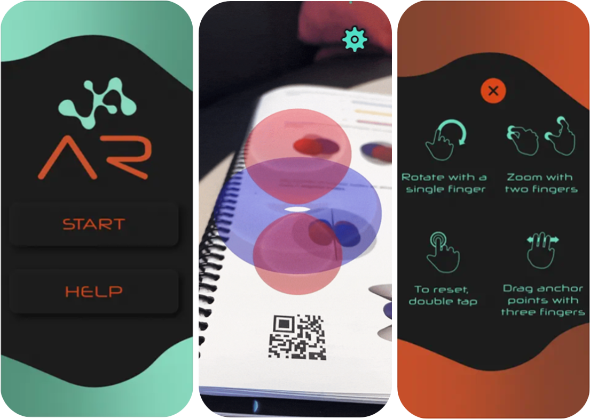

Welcome to MoleculAR, an augmented reality application that helps students understand 3D geometry in chemistry!
  All the QR codes for the structures available in the app, are free to download.
  You can use these QR codes in any learning capacity, whether you're a curious user looking to explore molecular geometry or an educator wishing to incorporate MoleculAR into your course syllabus.
  Here's a quick guide on how to download and use the app:

  <ul> <li>Step 1: Download the MoleculAR app from the App Store or Google Play Store on your smartphone or tablet device.</li>
    <li>Step 2: Open the app and select "START" to begin scanning the QR codes.</li>
    <li>Step 3: Scan the QR code for the molecule or orbital you want to view.</li>
    <li>Step 4: Explore the 3D model of the molecule or orbital that hovers over the QR Code. Rotate, zoom, and explore the structure from different angles.</li>
  </ul> 

  <a href="https://github.com/chagunda/moleculAR/raw/main/QRCodes.zip" class="centered-link">
    Download QR Codes HERE
  </a>    

  

  

Thank you for choosing MoleculAR! We welcome any feedback you may have on the app and its use in chemistry education. We hope that MoleculAR will be a valuable tool for educators and students alike.

  

  <footer>
    
App development by Julia Levy. Github repository by [Ian20%C.20%Chagunda](https://twitter.com/ian_chagunda).
 
    
For feedback or questions, please email [Prof. Dr. J. Scott McIndoe](https://web.uvic.ca/~mcindoe/) at [mcindoe@uvic.ca](mailto:mcindoe@uvic.ca).
 
    
To learn more, view the journal article on this project at https://doi.org/123.45.6789.

  </footer>

<footer>
  
App development by Julia Levy. Github repository by <a href="https://twitter.com/ian_chagunda">Ian C. Chagunda</a>.

  
For feedback or questions, please email <a href="mailto:mcindoe@uvic.ca">Prof. Dr. J. Scott McIndoe</a> at <a href="https://web.uvic.ca/~mcindoe/">mcindoe@uvic.ca</a>.

  
To learn more, view the journal article on this project at <a href="https://doi.org/123.45.6789">https://doi.org/123.45.6789</a>.

</footer>

